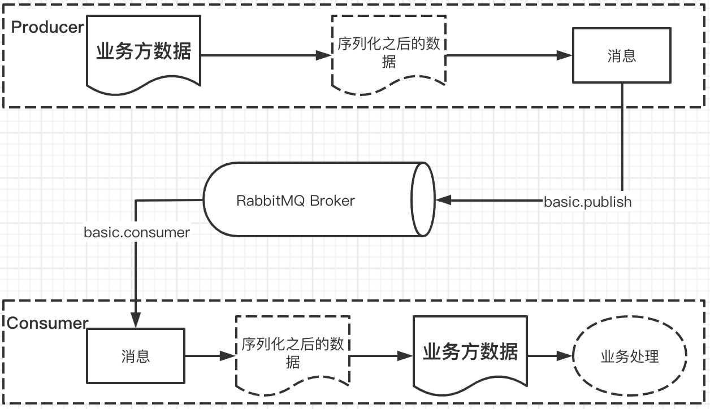
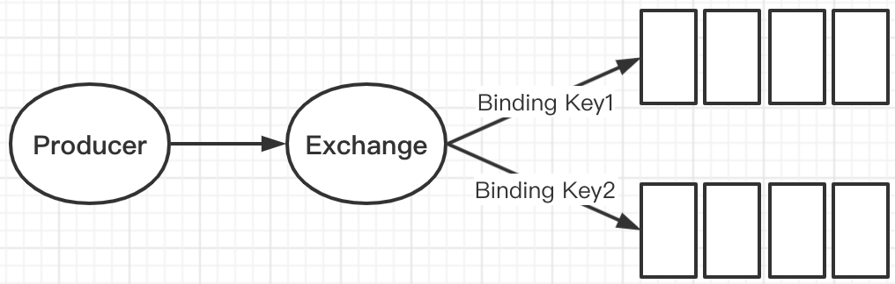

## 1 基本概念

### 1.1 作用

- **解耦**

  消息中间件允许我们将生产消息和消费消息两部分独立开来，只要他们遵循一致的接口规范即可，我们可以独立的扩展或者修改生产和消费的过程。

- **数据安全**

  某些极端情况下，数据的处理过程可能会失败。消息中间件可以把数据进行持久化存储直到他们已经被完全处理，通过这一方式规避了数据丢失的风险。

- **扩展性**

  因为消息中间件解耦了应用的处理过程，所以提高消息入队和处理的效率是很容易的，只要另外增加处理的过程即可。

- **削峰**

  在访问量剧增的情况下，应用仍然需要继续发挥作用，消息中间件组件能够使大批量的数据有条不紊的执行处理，不会因为突发的超负荷请求而导致完全崩溃。

- **可恢复性**

  当系统一部分组件失效时，不会影响到整个系统。消息中间件降低了进程间的耦合度，所以即使一个处理消息的进程挂掉，加入消息中间件的消息仍然可以在系统恢复后进行处理。

- **顺序保证**

  在很多情况下，数据处理的顺序很重要，大部分的消息中间件可以做到支持一定程度的顺序。

- **异步通讯**

  在很多时候应用不需要立即处理消息，中间件提供了异步处理机制，允许应用把一部分的消息放入中间件之后，延时一段时间处理。

### 1.2 相关概念

- Producer

  生产者，投递消息的一方。生产者创建的消息，一般包含两个部分：消息体（payload）和标签（label）。

- Consumer

  接受消息的一方。消费者连接到RabbitMQ，并订阅到队列上。当消费者消费一条消息时，只是消费的消息的消息体。在消息路由的过程中、标签部分会被丢弃，存入队列的部分也只有消息体。

- Broker

  消息中间件的服务节点

  

#### 1.2.1 队列

​	RabbitMQ中消息只能存储在队列中，与Kafka不同，Kafka中的消息存储在Topic这个逻辑层面，而对应的队列逻辑只是topic实际存储文件中的位移标识。Rabbit MQ将消息投递到队列中，消费者可以从队列中获取消息并消费。

​	多个消费者可以订阅同一个队列，这时队列中的消息会被平均分摊给多个消费者进行处理，而不是一个消费者处理全部的数据。

#### 1.2.2 交换器、路由键、绑定

- 交换器

​	生产者首先将消息投递到交换器（Exchange），由交换器将消息路由到一个或者多个队列中，如果路由不到，那么消息可能会返回给生产者，或者直接丢失。

- 路由键

  生产者将消息发送给交换器的时候，一般会指定一个`RoutingKey`，用来指定这个消息的路由规则，而这个`RoutingKey`需要与交换器类型和绑定键（`BindingKey`）联合使用才能生效。

- 绑定

  交换器与队列的关联依赖于`Binding`，在绑定的时候需要指定一个`BindingKey`，这样`RabbitMQ`就知道如何正确的将消息路由到队列了。

  

#### 1.2.3 交换器类型

- `fanout`

  无视路由键，MQ会将消息路由到所有绑定到该交换器的队列中。

- `direct`

  MQ会将消息路由到那些`BindingKey`和`RoutingKey`完全匹配的队列中。

- **`topic`**

  MQ会遵循模糊匹配规则，将消息路由到`BindingKey`和`RoutingKey`按照一定规则相匹配的队列中。

  - `RoutingKey`为一个点号“.”分隔的字符串，如："com.rabbit.client","java.util.concurrent","com.hidden.client"
  - `BindingKey`和`RoutingKey`类似，也是一个点号分隔的字符串
  - `BindingKey`中可以存在两种特殊的字符串"\*"和"#"，用于模糊匹配，其中"\*"匹配一个单词，"\#"匹配多个单词

  

- `headers`

  ​	`headers` 类型的交换器不依赖于路由键的匹配规则来路由消息，而是根据发送的消息内容中
  的 headers 属性进行匹配。在绑定队列和交换器时制定一组键值对 ， 当发送消息到交换器时，
  RabbitMQ 会获取到该消息的 headers (也是一个键值对的形式) ，对比其中的键值对是否完全
  匹配队列和交换器绑定时指定的键值对，如果完全匹配则消息会路由到该队列，否则不会路由
  到该队列 。这种方式性能很差，不常用。

#### 1.2.4 运转流程

- 发送消息流程
  - 生产者连接到 RabbitMQ Broker ， 建立一个连接( Connection) ，开启 一个信道 (Channel)  
  - 生产者声明一个交换器 ，并设置相关属性，比如 交换机类型、是否持久化等  
  - 生产者声明 一个队列井设置相关属性，比如是否排他、是否持久化、是否自动删除等  
  - 生产者通过路由键将交换器和队列绑定起来  
  - 生产者发送消息至 RabbitMQ Broker，其中包含路由键、交换器等信息  
  - 相应的交换器根据接收到的路由键查找相匹配的队列   
  - 如果找到 ，则将从生产者发送过来的消息存入相应的队列中  
  - 如果没有找到 ，则根据生产者配置的属性选择丢弃还是回退给生产者  
  - 关闭信道、关闭链接
- 消费消息流程
  - 消费者连接到 RabbitMQ Broker，建立一个连接 (Connection ) ，开启 一个信道 (Channel) 。  
  - 消费者向 RabbitMQ Broker 请求消费相应队列中的消息，可能会设置相应的回调函数， 
  - 等待 RabbitMQ Broker 回应并投递相应队列中的消息， 消费者接收消息  
  - 消费者确认 ( ack) 接收到的消息 。  
  - RabbitMQ 从队列中删除相应己经被确认的消息 。  
  - 关闭信道、关闭链接

​	无论是生产者还是消费者，都需要与MQ服务建立链接，就是一条TCP链接Connection。一旦TCP链接建立起来，客户端可以创建一个AMQP信道（Channel），每个信道都会被指派一个唯一的ID。信道是建立在Connection之上的虚拟链接，MQ处理的每一条AMQP指令都是通过信道完成的。

​	MQ没有采用Connection直接完成通信工作、而是引入了信道的概念，是考虑到多线程环境下、如果建立很多个Connection链接，那么必然是非常昂贵的开销，这样很容易引发性能瓶颈。RabbitMQ采用类似NIO的做法，选择TCP链接复用。每个线程占有一个信道（Channel），当信道流量比较小的时候，这种模式很节省资源；当信道流量很大时，可以创建多个Connection来应对访问压力。

### 1.3 AMQP

#### 1.3.1 协议

AMQP协议分为三层：

- Module Layer：位于协议最高层，主要定义了一些供客户端调用的命令，客户端可以利用这些命令实现自己的业务逻辑。
- Session Layer：位于协议中间层，主要负责客户端的命令发送给服务器，再将服务端的响应返回给客户端，主要为客户端与服务器之间的通信提供可靠性同步机制和错误处理。
- Transport Layer：位于协议最底层，主要传输二进制数据流，提供帧的处理，信道复用，错误检测和数据表示等。

#### 1.3.2 生产者流程

- 当客户端与 Broker 建立连接的时候，会调用 factory .newC onnection 方法  ，这个方法会进一步封装成 Protocol Header 0-9-1 的报文头发送给 Broker，以此通知 Broker 本次交互采用的是 AMQPO-9-1 协议，紧接着 Broker 返回 Connection.Start 来建立连接，在连接的过程 中涉及 Connection.Start/.Start-OK 、Connection.Tune/.Tune-Ok ， Connection.Open/ .Open-Ok 这 6 个命令的交互 。  

- 当客户端调用 connection .createChannel 方法准备开启 信道的时候，其包装Channel . Open 命令发送给 Broker，等待 Channel.Open-Ok 命令 。  

- 当客户端发送消息的时候，需要调用 channel . basicPublish 方法，对应的 AQMP 命令为 Basic.Publish ，注意这个命令和前面涉及的命令略有不同，这个命令还包含了 ContentHeader 和 Content Body 0 Content Header 里面包含的是消息体的属性。

- 当客户端发送完消息需要关闭资源时，涉及 Channel.Close/.Close-Ok 与Connection.Close/.Close-Ok 的命令交互。  

  

#### 1.3.3 消费者流程

- 消费者客户端同样需要与 Broker 建立连接，与生产者客户端一样，协议交互同样涉及Connection.Start/ . Start-Ok 、 Connection.Tune/.Tune-Ok 和 Connection.Open/ . Open-Ok   等。
- 紧接着也少不了在 Connection 之上建立 Channe l，和生产者客户端一样，协议涉及Channel . Open/Open-Ok。
- 如果在消费之前调用了 channel . basicQos(int prefetchCount) 的方法来设置消费者客户端最大能"保持"的未确认的消息数，那么协议流转会涉及 Basic.Qos/.Qos-Ok 这两个 AMQP 命令。  
- 在真正消费之前，消费者客户端需要向 Broker 发送 Basic.Consume 命令(即调用channel.basicConsume 方法〉将 Channel 置为接收模式，之后 Broker 回执Basic . Consume - Ok 以告诉消费者客户端准备好消费消息。紧接着 Broker 向消费者客户端推送 (Push) 消息，即 Basic.Deliver 命令，有意思的是这个和 Basic.Publish 命令一样会携带 Content Header 和 Content Body。
- 消费者接收到消息并正确消费之后，向 Broker 发送确认，即 Basic.Ack 命令。  
- 在消费者停止消费的时候，主动关闭连接，这点和生产者 一 样，涉及Channel . Close/ . Close-Ok 手口 Connection.Close/ . Close-Ok。