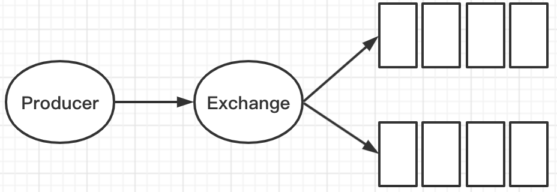

## 1 基本概念

### 1.1 作用

- **解耦**

  消息中间件允许我们将生产消息和消费消息两部分独立开来，只要他们遵循一致的接口规范即可，我们可以独立的扩展或者修改生产和消费的过程。

- **数据安全**

  某些极端情况下，数据的处理过程可能会失败。消息中间件可以把数据进行持久化存储直到他们已经被完全处理，通过这一方式规避了数据丢失的风险。

- **扩展性**

  因为消息中间件解耦了应用的处理过程，所以提高消息入队和处理的效率是很容易的，只要另外增加处理的过程即可。

- **削峰**

  在访问量剧增的情况下，应用仍然需要继续发挥作用，消息中间件组件能够使大批量的数据有条不紊的执行处理，不会因为突发的超负荷请求而导致完全崩溃。

- **可恢复性**

  当系统一部分组件失效时，不会影响到整个系统。消息中间件降低了进程间的耦合度，所以即使一个处理消息的进程挂掉，加入消息中间件的消息仍然可以在系统恢复后进行处理。

- **顺序保证**

  在很多情况下，数据处理的顺序很重要，大部分的消息中间件可以做到支持一定程度的顺序。

- **异步通讯**

  在很多时候应用不需要立即处理消息，中间件提供了异步处理机制，允许应用把一部分的消息放入中间件之后，延时一段时间处理。

### 1.2 相关概念

- Producer

  生产者，投递消息的一方。生产者创建的消息，一般包含两个部分：消息体（payload）和标签（label）。

- Consumer

  接受消息的一方。消费者连接到RabbitMQ，并订阅到队列上。当消费者消费一条消息时，只是消费的消息的消息体。在消息路由的过程中、标签部分会被丢弃，存入队列的部分也只有消息体。

- Broker

  消息中间件的服务节点

  

#### 1.2.1 队列

​	RabbitMQ中消息只能存储在队列中，与Kafka不同，Kafka中的消息存储在Topic这个逻辑层面，而对应的队列逻辑只是topic实际存储文件中的位移标识。Rabbit MQ将消息投递到队列中，消费者可以从队列中获取消息并消费。

​	多个消费者可以订阅同一个队列，这时队列中的消息会被平均分摊给多个消费者进行处理，而不是一个消费者处理全部的数据。

#### 1.2.2 交换器、路由键、绑定

- 交换器

​	生产者首先将消息投递到交换器（Exchange），由交换器将消息路由到一个或者多个队列中，如果路由不到，那么消息可能会返回给生产者，或者直接丢失。

- 路由键

  生产者将消息发送给交换器的时候，一般会指定一个RoutingKey，用来指定这个消息的路由规则，而这个RoutingKey需要与交换器类型和绑定键（BindingKey）联合使用才能生效。

- 绑定

  交换器与队列的关联依赖于Binding，在绑定的时候需要指定一个BindingKey，这样RabbitMQ就知道如何正确的将消息路由到队列了。

  

