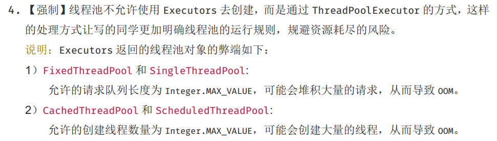

## 1 线程池

> 阿里巴巴java开发手册关于线程池的建议：



### 1.1 三个创建方法

​	**Executors**提供了三种创建线程池的方法

- 创建只有一个线程的线程池

  ```java
  ExecutorService threadPool = Executors.newSingleThreadExecutor();
  
  // Executors 类实现
  public static ExecutorService newSingleThreadExecutor() {
      return new FinalizableDelegatedExecutorService
          (new ThreadPoolExecutor(1, 1,
                                  0L, TimeUnit.MILLISECONDS,
                                  new LinkedBlockingQueue<Runnable>()));
  }
  ```

- 创建指定线程数量的线程池

  ```java
  ExecutorService threadPool = Executors.newFixedThreadPool(3);
  
  // Executors 类实现
  public static ExecutorService newFixedThreadPool(int nThreads) {
      return new ThreadPoolExecutor(nThreads, nThreads,
                                    0L, TimeUnit.MILLISECONDS,
                                    new LinkedBlockingQueue<Runnable>());
  }
  ```

- 创建**Integer.MAX_VALUE**容量的线程池（可能OOM，所以java手册不建议使用Executors）

  ```java
  ExecutorService threadPool = Executors.newCachedThreadPool();
  
  // Executors 类实现
  public static ExecutorService newCachedThreadPool() {
      return new ThreadPoolExecutor(0, Integer.MAX_VALUE,
                                    60L, TimeUnit.SECONDS,
                                    new SynchronousQueue<Runnable>());
  }
  ```

### 1.2 七个参数

```java
// CPU密集型： maximumPoolSize = Runtime.getRuntime().availableProcessors()
// IO密集型：maximumPoolSize 应大于当前IO最耗时的任务数
ExecutorService threadPool = new ThreadPoolExecutor(2, 				// corePoolSize
                         5,											// maximumPoolSize
                         2,											// keepAliveTime
                         TimeUnit.HOURS,							// unit
                         new ArrayBlockingQueue<>(3),				// workQueue
                         Executors.defaultThreadFactory(),			// threadFactory
                         new ThreadPoolExecutor.CallerRunsPolicy()	// handler
 );

try {
    for (int i = 0; i < 9; i++) {
        threadPool.execute(() -> {
            System.out.println(Thread.currentThread().getName() + " ok");
        });
    }
} finally {
    threadPool.shutdown();
}
​```
```


```java
ExecutorService threadPool = new ThreadPoolExecutor(2, 				// corePoolSize
                         5,											// maximumPoolSize
                         2,											// keepAliveTime
                         TimeUnit.HOURS,							// unit
                         new ArrayBlockingQueue<>(3),				// workQueue
                         Executors.defaultThreadFactory(),			// threadFactory
                         new ThreadPoolExecutor.CallerRunsPolicy()	// handler
 );

try {
    for (int i = 0; i < 9; i++) {
        threadPool.execute(() -> {
            System.out.println(Thread.currentThread().getName() + " ok");
        });
    }
} finally {
    threadPool.shutdown();
}
```

- 当 **i <= 5**时，线程池只会有两个线程在工作

  ```java
  pool-1-thread-1 ok
  pool-1-thread-2 ok
  pool-1-thread-1 ok
  pool-1-thread-2 ok
  pool-1-thread-1 ok
  ```

- 当**i > 5 且 i <= 8**时，线程池会保持 **<5** 个线程(<span style='color:red'>**maximumPoolSize**</span>)在工作

  ```java
  pool-1-thread-1 ok
  pool-1-thread-4 ok
  pool-1-thread-3 ok
  pool-1-thread-2 ok
  pool-1-thread-3 ok
  pool-1-thread-4 ok
  pool-1-thread-1 ok
  pool-1-thread-5 ok
  ```

- 当**i>8**时，如果5个线程已经全负载工作，那么会有3个进入阻塞队列，8个以外的任务将会执行拒绝策略

  ```java
  // 当拒绝策略为 CallerRunsPolicy 时，线程池解决不了的任务将会返回给父线程处理
  pool-1-thread-1 ok
  main ok
  pool-1-thread-3 ok
  pool-1-thread-2 ok
  pool-1-thread-3 ok
  pool-1-thread-5 ok
  pool-1-thread-1 ok
  pool-1-thread-4 ok
  pool-1-thread-2 ok
  ```

### 1.3 四种拒绝策略

```java 
new ThreadPoolExecutor.AbortPolicy(); // 抛出异常
new ThreadPoolExecutor.CallerRunsPolicy(); // 返回给调用者处理
new ThreadPoolExecutor.DiscardPolicy(); // 不抛出异常，直接丢弃
new ThreadPoolExecutor.DiscardOldestPolicy(); // 队列满了，尝试去和最早执行的线程竞争，如果最早线程执行结束、那么该线程获取执行权；否则丢弃
```

## 2 Lambda

### 2.1 四大函数式接口

- 函数型接口：Function

  ```java
  Function<String, String> function = new Function<String, String>() {
      @Override
      public String apply(String s) {
          return s;
      }
  };
  
  System.out.println(function.apply("test"));
  
  // 修改为lambda表达式
  Function<String, String> function = (str) -> str;
  System.out.println(function.apply("test"));
  ```

- 断言型接口：Predicate

  ```java
  Predicate<String> ss = new Predicate<String>() {
      @Override
      public boolean test(String s) {
          return false;
      }
  };
  System.out.println(ss.test("ss"));
  
  // 修改为lambda表达式
  Predicate<String> s = s1 -> false;
  System.out.println(s.test("ss"));
  ```

- 消费型接口：Consumer

  ```java
  Consumer<Integer> consumer = new Consumer<Integer>() {
      @Override
      public void accept(Integer integer) {
          System.out.println(integer);
      }
  };
  
  consumer.accept(1);
  
  // lambda
  Consumer<Integer> consumer = (i) -> System.out.println(i);
  consumer.accept(11);
  
  // 依托System.out.println的属性，可以进一步优化
  Consumer<Integer> consumer = System.out::println;
  consumer.accept(11);
  ```

- 供给型接口：Supplier

  ```java
  Supplier<String> supplier = new Supplier<String>() {
      @Override
      public String get() {
          return "success";
      }
  };
  System.out.println(supplier.get());
  
  // lambda
  Supplier<String> supplier = () -> "success";
  System.out.println(supplier.get());
  ```

### 2.2 Stream流式计算

```java
/**
 * 1、ID必须是偶数
 * 2、年龄必须大于23岁
 * 3、用户名转为大写
 * 4、用户名字母倒叙排
 * 5、只输出一个用户
 */
public static void test1() {
    User user1 = new User(1, 21, "a");
    User user2 = new User(2, 22, "b");
    User user3 = new User(3, 23, "c");
    User user4 = new User(4, 24, "d");
    User user5 = new User(5, 25, "e");
    User user6 = new User(6, 26, "f");

    List<User> list = Arrays.asList(user1, user2, user3, user4, user5, user6);

    list.stream()
        .filter(u -> u.getId() % 2 == 0)
        .filter(u -> u.getAge() > 23)
        .map(u -> u.getName().toUpperCase())
        .sorted((u1, u2) -> u2.compareTo(u1))
        .limit(1)
        .forEach(System.out::println);
}
```

### 2.3 ForkJoin

> ***FormJoin***实在JDK1.7中，并行执行任务，提升效率。

ForkJoin是分治思想的一种实现。一个复杂的计算，根据我们设定的阈值分解成多个子计算，然后将各个结果进行汇总。


- 工作窃取

  > 子任务A已经执行完了，子任务B还没有执行完毕，此时如果子任务A等待，那么会浪费资源。这时候子任务A会主动的在子任务B队列的另一端进行处理（**双端队列**），处理完毕之后归还给子任务B，以此提升执行效率.